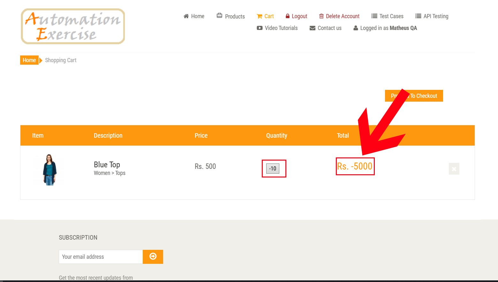
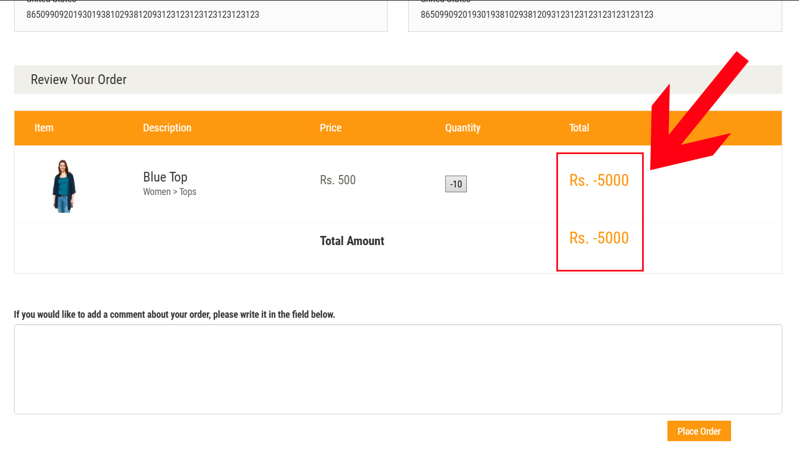

# Desafio G-Click

##  Sobre o Projeto
Este projeto tem como objetivo validar o fluxo completo de um e-commerce utilizando testes automatizados com **Cypress**.

O foco da automação está nos principais fluxos do usuário:
- Login
- Adição de produtos ao carrinho
- Validação dos itens adicionados

## Arquitetura do Projeto

O projeto foi estruturado com foco em reutilização e organização:

- **Custom Commands:** encapsulamento de ações como login, adicionar produtos e chamadas de API.
- **Fixtures:** gestão de dados sensíveis de forma isolada.
- **Utils:** geração de dados dinâmicos com Faker.
- **Separação por domínio:** testes organizados em pastas (login, carrinho, api).

---

##  Escopo dos Testes

###  Funcionalidade: Login e Adição de Produtos ao Carrinho

**Como** um usuário do e-commerce  
**Quero** iniciar sessão e adicionar produtos ao carrinho  
**Para** validar que os itens foram adicionados corretamente  

---

###  Cenário Positivo

    Cenário: Login com sucesso e adicionar dois produtos ao carrinho

    Dado que acessei a página de login
    E realizei login com sucesso
    Quando acesso a página de produtos
    E adiciono dois produtos diferentes ao carrinho
    E acesso o meu carrinho
    Então o meu carrinho deve conter os produtos adicionados corretamente

###  Cenário Negativo

    Cenário: Tentativa de login com credenciais inválidas

    Dado que acessei a página de login
    Quando informo um e-mail ou senha inválidos
    E clico em 'Login'
    Então devo visualizar a mensagem "Your email or password is incorrect!"

---

##  Bug Report

###  Título
Campo de quantidade permite valores inválidos na página de detalhes do produto

###  Descrição
O campo de quantidade na página de detalhes de qualquer produto não possui uma trava de valor mínimo. Isso permite que um usuário insira manualmente números negativos, zero, afetando a lógica do carrinho de compras.

###  Ambiente
- **URL:** https://automationexercise.com/product_details/1  
- **Navegadores:** Chrome, Opera GX  

### Passos
>1. Acesse a página de produtos  
>2. Selecione um produto  
>3. Clique em **View Product**  
>4. Insira um valor negativo no campo **Quantity**  
>5. Clique em **Add to cart**  
>6. Verifique o carrinho  

### Resultado Atual
O sistema permite inserir valores inválidos no campo de quantidade, sem qualquer validação.

### Resultado Esperado
O sistema deveria permitir apenas valores numéricos positivos, definir valor mínimo como 1, bloquear caracteres inválidos, exibir mensagem de erro para entradas inválidas

### Evidências

---
## Testes de API

Foi implementado um teste automatizado para o endpoint:

**POST /api/createAccount**

Validações realizadas:
- Status Code da requisição
- Estrutura da resposta
- Mensagem de sucesso ("User created!")
- Geração de dados dinâmicos com Faker para evitar duplicidade

Esse teste garante que a API está funcional e aceita criação de novos usuários corretamente.

---
## Para executar os Testes Automatizados
### Pré-requisitos
- IDE (Ex: Visual Studio Code), para baixar [clique aqui.](https://code.visualstudio.com)
- Node.js, para baixar [clique aqui.](https://nodejs.org/en/)
- Cypress, para instalar [clique aqui.](https://docs.cypress.io/guides/getting-started/installing-cypress)
---

###  Instalação
No diretório do projeto, execute o seguinte comando para instalar as dependências:

    npm install

---

### Execução dos Testes

#### Rodar no modo interativo

    npx cypress open

#### Rodar com Allure em modo headless

    npx cypress run --config video=true --env allure=true

---
## Tecnologias utilizadas

* [GIT](https://git-scm.com/) - Sistema de controle de versões.
* [Node.js](https://nodejs.org/en/) - Software que permite a execução de códigos JavaScript fora de um navegador web.
* [NPM](https://www.npmjs.com/) - Gerenciador de pacotes para o Node.JS
* [Cypress](https://www.cypress.io/) - Framework de automação de testes de ponta a ponta, focado em front-end para aplicativos da web
* [@faker-js/faker](https://www.npmjs.com/package/@faker-js/faker) - Biblioteca que possibilita a geração de uma grande quantidade de dados falsos nos browsers ou no back-end.
* [Allure](https://www.npmjs.com/package/allure-commandline)  -  Ferramenta que cria relatórios de execução de testes web.

---
